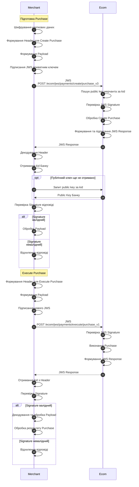

# Опис роботи з JWS

## Приклад роботи з JWS для Purchase платежу

#### Опис :&#x20;

1. Мерчант шифрує карткові дані.
2. Формує `payload` для Create Purchase.
3. Формує `header` з `alg`, `kid`, `ts` та `targetUrl`.
4. Підписує JWS своїм приватним ключем.
5. Відправляє JWS на `/ecom/jws/payments/create/purchase_v3`.
6. Отримує JWS-відповідь Банку.
7. Отримує `kid` з `header` відповіді.
8. За необхідності отримує відповідний public key Банку та верифікує підпис відповіді.
9. Отримує дані для наступного кроку з `payload`.
10. Формує новий JWS для Execute Purchase.
11. Відправляє його на `/ecom/jws/payments/execute/purchase_v1`.
12. Отримує фінальну JWS-відповідь.
13. Перевіряє її цифровий підпис.
14. Обробляє результат виконання Purchase.
