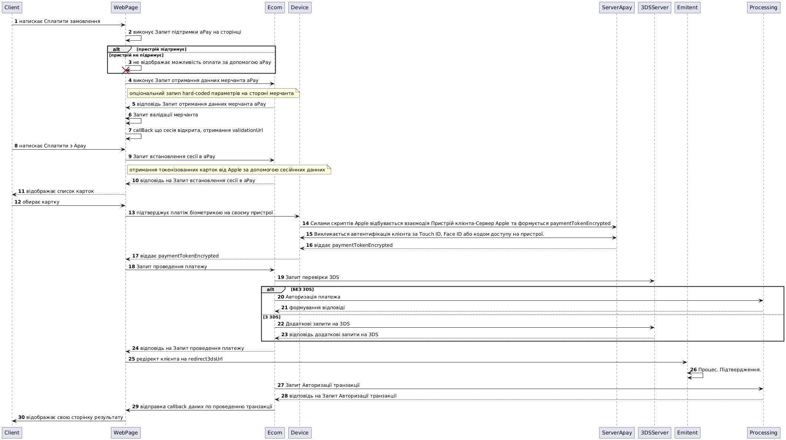

# ApplePay encrypted

<figure><figcaption></figcaption></figure>

1. Клієнт натискає кнопку «Сплатити замовлення» на сайті/в застосунку.
2. WebPage запускає скрипт Запит підтримки Apple Pay, щоб перевірити, чи підтримується Apple Pay на цій сторінці.
3. Якщо пристрій клієнта не підтримує оплату через аРay, клієнт не зможе скористатися цим способом оплати, і запит буде відхилено.
4. Якщо підтримується, webPage надсилає опціональний Запит отримання даних мерчанта в Apple Pay. Можливо зробити hard-coded даних Apple Pay на стороні мерчанта
5. WebPage запускає скрипт на валідацію мерчанта через Apple Pay для підтвердження даних.
6. Apple Pay повертає callback з параметром validationUrl.
7. Клієнт натискає кнопку Сплатити з Apple Pay, підтверджуючи вибір цього способу оплати.
8. Встановлюється сесія з Apple Pay, і пристрій клієнта готовий до взаємодії з Apple Pay.
9. У відповідь на встановлення сесії Apple передає токенізовані дані карт клієнта.
10. Клієнту відображається список карток на пристрої, які можна використовувати для оплати.
11. Клієнт обирає картку, яку хоче використати для оплати.
12. Скрипт на пристрої клієнта взаємодіє з сервером Apple для отримання зашифрованого paymentToken
13. Викликається автентифікація клієнта через біометрію або пароль.
14. Apple формує paymentToken, який передається на webPage для подальшої обробки.
15. WebPage надсилає Запит проведення платежу, використовуючи отриманий токен.
16. Якщо необхідна перевірка через 3D Secure (3DS), починається цей процес. Якщо 3DS не потрібен, транзакція продовжується.
17. Гілка без 3DS:
    * Виконується авторизація платежу.
    * &#x20;Формується відповідь на запит проведення платежу.
18. Гілка з 3DS:
    * &#x20;Виконується додаткова перевірка через 3DS.
    * Після завершення перевірки надається відповідь на запит проведення платежу з параметром redirect3dsUrl.
    * webPage перенаправляє клієнта на сторінку redirect3dsUrl для підтвердження 3DS.
    * &#x20;Клієнт підтверджує транзакцію через 3DS.
    * Транзакція авторизується.
19. Надсилається callback мерчанту, на вказаний notificationUrl, з даними про проведену транзакцію.
20. Клієнту відображається сторінка результату, яка інформує про завершення оплати.

 
