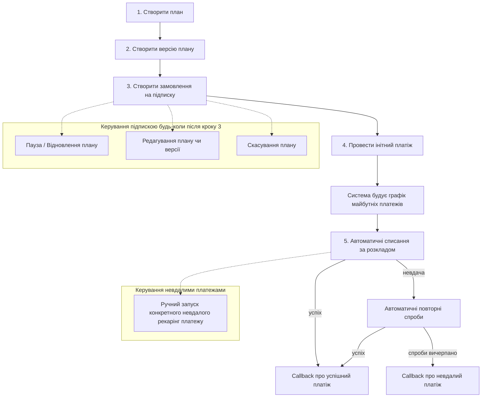

# Recurring Payment

### Ключові поняття

<table><thead><tr><th width="197.0667724609375">Сутність</th><th>Опис</th></tr></thead><tbody><tr><td><strong>План</strong> </td><td>Шаблон підписки: тип категорії, назва, параметри. Один план можна використовувати для багатьох клієнтів.</td></tr><tr><td><strong>Версія плану</strong>  </td><td>Конкретні умови списання в межах плану: сума, періодичність, період дії. Активна лише одна версія одночасно.</td></tr><tr><td><strong>Замовлення</strong> </td><td>Підписка конкретного клієнта на план. Створюється один раз і діє, доки клієнт підписаний.</td></tr><tr><td><strong>Інітний платіж</strong></td><td>Перший платіж клієнта, яким відкривається підписка і зберігається платіжний токен.</td></tr><tr><td><strong>Заплановані платежі</strong> </td><td>Наступні автоматичні списання за розкладом, який система будує на основі версії плану.</td></tr></tbody></table>
