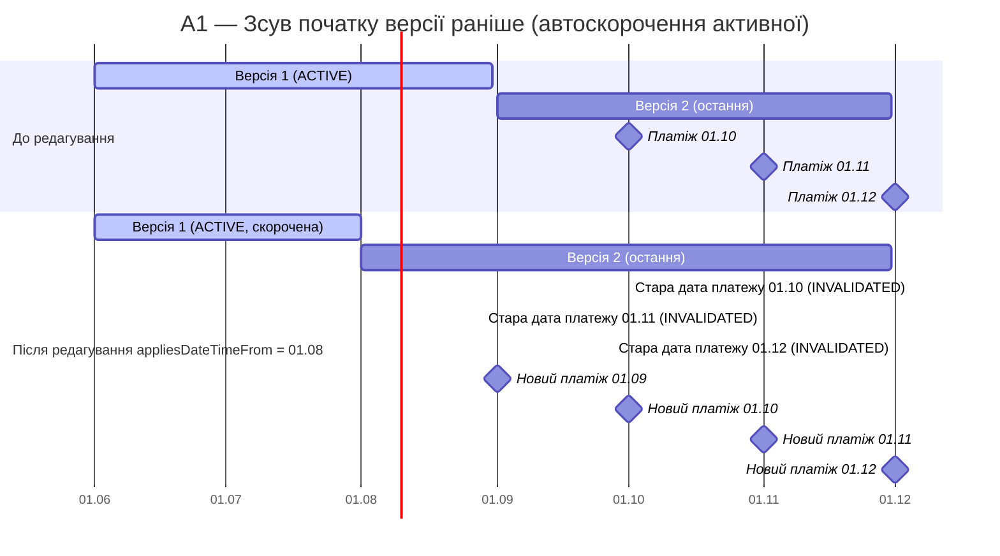
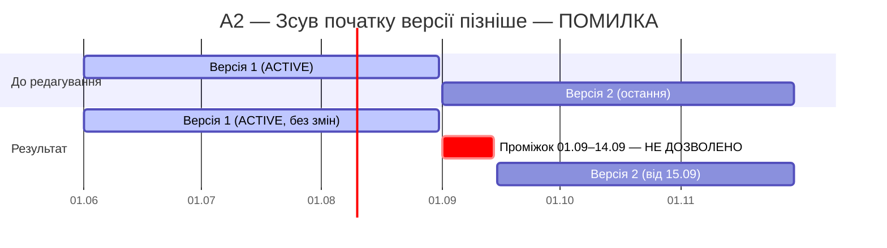
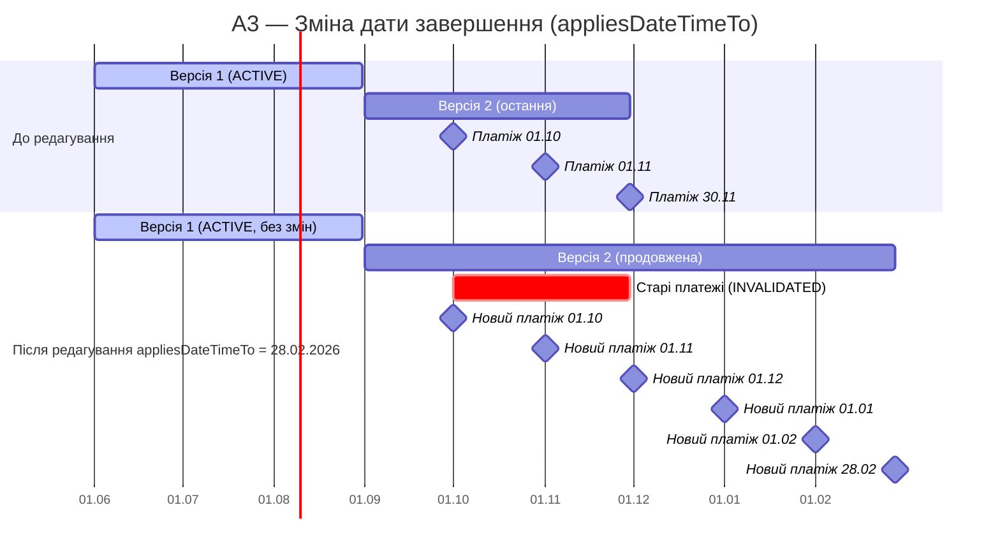
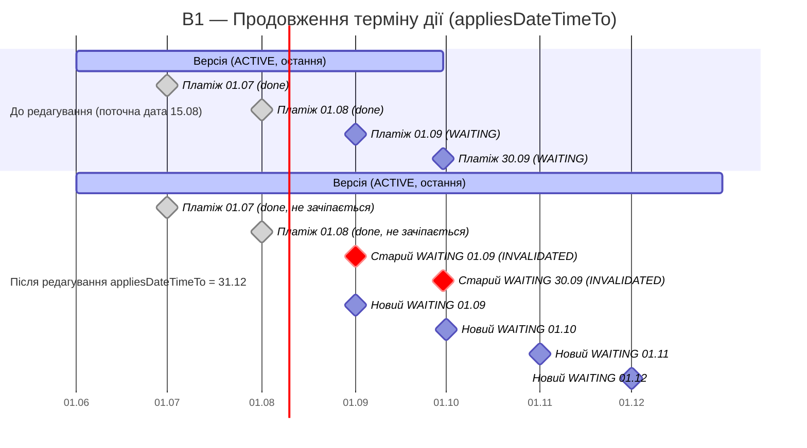
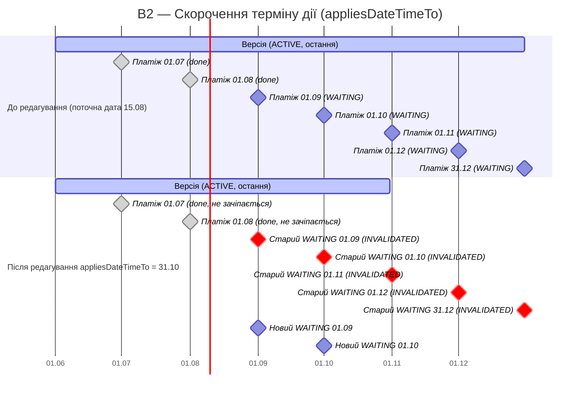
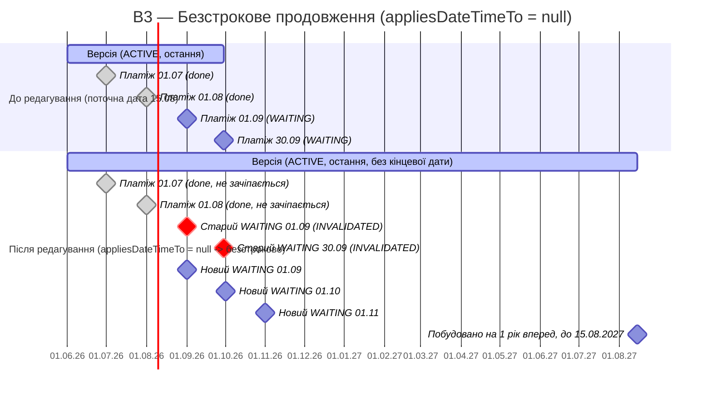

# Схематичне зображення

**Сценарій A — Версія ще не почалась**

```mermaid
gantt
    title A1 — Зсув початку версії раніше (автоскорочення активної)
    dateFormat YYYY-MM-DD
    axisFormat %d.%m

    section До редагування
    Версія 1 (ACTIVE)        :active, v1a, 2026-06-01, 2026-08-31
    Версія 2 (остання)       :v2a, 2026-09-01, 2026-11-30
    Платіж 01.10             :milestone, p1a, 2026-10-01, 0d
    Платіж 01.11             :milestone, p2a, 2026-11-01, 0d
    Платіж 01.12             :milestone, p3a, 2026-12-01, 0d

 
    section Після редагування  appliesDateTimeFrom = 01.08
    Версія 1 (ACTIVE, скорочена) :active, v1b, 2026-06-01, 2026-08-01
    Версія 2 (остання)           :v2b, 2026-08-01, 2026-11-30
    Стара дата платежу 01.10 (INVALIDATED) :crit, x1, 2026-10-01, 0d
    Стара дата платежу 01.11 (INVALIDATED) :crit, x2, 2026-11-01, 0d
    Стара дата платежу 01.12 (INVALIDATED) :crit, x3, 2026-12-01, 0d
    Новий платіж 01.09        :milestone, n1, 2026-09-01, 0d
    Новий платіж 01.10        :milestone, n2, 2026-10-01, 0d
    Новий платіж 01.11        :milestone, n3, 2026-11-01, 0d
    Новий платіж 01.12        :milestone, n4, 2026-12-01, 0d
```

```mermaid
gantt
    title A2 — Зсув початку версії пізніше — ПОМИЛКА
    dateFormat YYYY-MM-DD
    axisFormat %d.%m

    section До редагування
    Версія 1 (ACTIVE)        :active, v1a, 2026-06-01, 2026-08-31
    Версія 2 (остання)       :v2a, 2026-09-01, 2026-11-30

    section Мерчант змінює appliesDateTimeFrom = 15.09

    section Результат
    Версія 1 (ACTIVE, без змін) :active, v1b, 2026-06-01, 2026-08-31
    Проміжок 01.09–14.09 — НЕ ДОЗВОЛЕНО :crit, gap, 2026-09-01, 2026-09-14
    Версія 2 (від 15.09)         :v2b, 2026-09-15, 2026-11-30
```

```mermaid
gantt
    title A3 — Зміна дати завершення (appliesDateTimeTo)
    dateFormat YYYY-MM-DD
    axisFormat %d.%m

    section До редагування
    Версія 1 (ACTIVE)        :active, v1a, 2026-06-01, 2026-08-31
    Версія 2 (остання)       :v2a, 2026-09-01, 2026-11-30
    Платіж 01.10             :milestone, p1a, 2026-10-01, 0d
    Платіж 01.11             :milestone, p2a, 2026-11-01, 0d
    Платіж 30.11             :milestone, p3a, 2026-11-30, 0d

    section Після редагування appliesDateTimeTo = 28.02.2026
    Версія 1 (ACTIVE, без змін)  :active, v1b, 2026-06-01, 2026-08-31
    Версія 2 (продовжена)        :v2b, 2026-09-01, 2027-02-28
    Старі платежі (INVALIDATED)  :crit, x1, 2026-10-01, 2026-11-30
    Новий платіж 01.10           :milestone, n1, 2026-10-01, 0d
    Новий платіж 01.11           :milestone, n2, 2026-11-01, 0d
    Новий платіж 01.12           :milestone, n3, 2026-12-01, 0d
    Новий платіж 01.01           :milestone, n4, 2027-01-01, 0d
    Новий платіж 01.02           :milestone, n5, 2027-02-01, 0d
    Новий платіж 28.02           :milestone, n6, 2027-02-28, 0d
```

**Сценарій B — Версія вже діє**

```mermaid
gantt
    title B1 — Продовження терміну дії (appliesDateTimeTo)
    dateFormat YYYY-MM-DD
    axisFormat %d.%m

    section До редагування (поточна дата 15.08)
    Версія (ACTIVE, остання)     :active, v1, 2026-06-01, 2026-09-30
    Платіж 01.07 (done)          :done, milestone, p1, 2026-07-01, 0d
    Платіж 01.08 (done)          :done, milestone, p2, 2026-08-01, 0d
    Платіж 01.09 (WAITING)       :milestone, p3, 2026-09-01, 0d
    Платіж 30.09 (WAITING)       :milestone, p4, 2026-09-30, 0d

    section Після редагування appliesDateTimeTo = 31.12
    Версія (ACTIVE, остання)     :active, v2, 2026-06-01, 2026-12-31
    Платіж 01.07 (done, не зачіпається) :done, milestone, n1, 2026-07-01, 0d
    Платіж 01.08 (done, не зачіпається) :done, milestone, n2, 2026-08-01, 0d
    Старий WAITING 01.09 (INVALIDATED) :crit, milestone, x1, 2026-09-01, 0d
    Старий WAITING 30.09 (INVALIDATED) :crit, milestone, x2, 2026-09-30, 0d
    Новий WAITING 01.09          :milestone, w1, 2026-09-01, 0d
    Новий WAITING 01.10          :milestone, w2, 2026-10-01, 0d
    Новий WAITING 01.11          :milestone, w3, 2026-11-01, 0d
    Новий WAITING 01.12          :milestone, w4, 2026-12-01, 0d
```

```mermaid
gantt
    title B2 — Скорочення терміну дії (appliesDateTimeTo)
    dateFormat YYYY-MM-DD
    axisFormat %d.%m

    section До редагування (поточна дата 15.08)
    Версія (ACTIVE, остання)     :active, v1, 2026-06-01, 2026-12-31
    Платіж 01.07 (done)          :done, milestone, p1, 2026-07-01, 0d
    Платіж 01.08 (done)          :done, milestone, p2, 2026-08-01, 0d
    Платіж 01.09 (WAITING)       :milestone, p3, 2026-09-01, 0d
    Платіж 01.10 (WAITING)       :milestone, p4, 2026-10-01, 0d
    Платіж 01.11 (WAITING)       :milestone, p5, 2026-11-01, 0d
    Платіж 01.12 (WAITING)       :milestone, p6, 2026-12-01, 0d
    Платіж 31.12 (WAITING)       :milestone, p7, 2026-12-31, 0d

    section Після редагування appliesDateTimeTo = 31.10
    Версія (ACTIVE, остання)     :active, v2, 2026-06-01, 2026-10-31
    Платіж 01.07 (done, не зачіпається) :done, milestone, n1, 2026-07-01, 0d
    Платіж 01.08 (done, не зачіпається) :done, milestone, n2, 2026-08-01, 0d
    Старий WAITING 01.09 (INVALIDATED)  :crit, milestone, x1, 2026-09-01, 0d
    Старий WAITING 01.10 (INVALIDATED)  :crit, milestone, x2, 2026-10-01, 0d
    Старий WAITING 01.11 (INVALIDATED)  :crit, milestone, x3, 2026-11-01, 0d
    Старий WAITING 01.12 (INVALIDATED)  :crit, milestone, x4, 2026-12-01, 0d
    Старий WAITING 31.12 (INVALIDATED)  :crit, milestone, x5, 2026-12-31, 0d
    Новий WAITING 01.09          :milestone, w1, 2026-09-01, 0d
    Новий WAITING 01.10          :milestone, w2, 2026-10-01, 0d
```

```mermaid
gantt
    title B3 — Безстрокове продовження (appliesDateTimeTo = null)
    dateFormat YYYY-MM-DD
    axisFormat %d.%m.%y

    section До редагування (поточна дата 15.08)
    Версія (ACTIVE, остання)     :active, v1, 2026-06-01, 2026-09-30
    Платіж 01.07 (done)          :done, milestone, p1, 2026-07-01, 0d
    Платіж 01.08 (done)          :done, milestone, p2, 2026-08-01, 0d
    Платіж 01.09 (WAITING)       :milestone, p3, 2026-09-01, 0d
    Платіж 30.09 (WAITING)       :milestone, p4, 2026-09-30, 0d

    section Мерчант змінює appliesDateTimeTo = null

    section Після редагування (appliesDateTimeTo = null -> безстроково)
    Версія (ACTIVE, остання, без кінцевої дати) :active, v2, 2026-06-01, 2027-08-15
    Платіж 01.07 (done, не зачіпається) :done, milestone, n1, 2026-07-01, 0d
    Платіж 01.08 (done, не зачіпається) :done, milestone, n2, 2026-08-01, 0d
    Старий WAITING 01.09 (INVALIDATED) :crit, milestone, x1, 2026-09-01, 0d
    Старий WAITING 30.09 (INVALIDATED) :crit, milestone, x2, 2026-09-30, 0d
    Новий WAITING 01.09          :milestone, w1, 2026-09-01, 0d
    Новий WAITING 01.10          :milestone, w2, 2026-10-01, 0d
    Новий WAITING 01.11          :milestone, w3, 2026-11-01, 0d
    Побудовано на 1 рік вперед, до 15.08.2027 :milestone, w4, 2027-08-15, 0d
```

