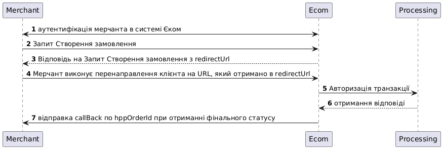

# Платіжні методи HPP

За допомогою HPP API ви можете легко приймати платежі з банківських карток (кредитних та дебетових) за товари чи послуги у вашому додатку або на веб-сайті.&#x20;

Наш API також надає можливість відстежувати статус транзакцій у реальному часі та отримувати автоматичні сповіщення (callBack) про завершення платежів, що допоможе вам забезпечити безперебійну роботу прийому платіжів.

<figure><figcaption></figcaption></figure>

1. Підготуйте запит на створення замовлення по інструкції
2. Виконайте перенаправлення клієнта на нашу платіжну сторінку (redirectUrl)
3. Очікуйте на callback або виконайте запит перевірки статусу.
