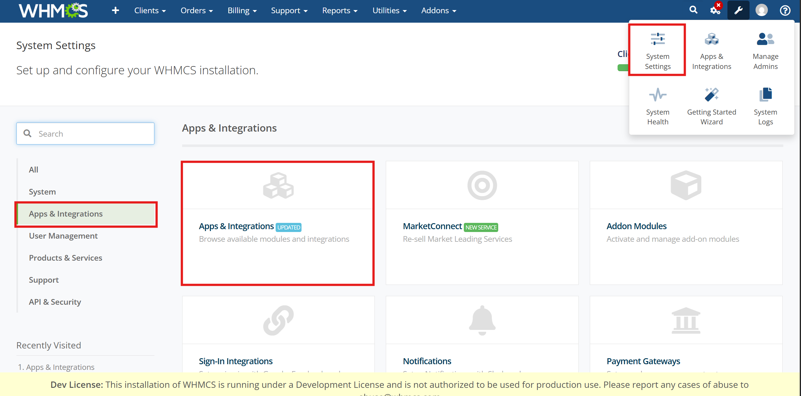

# Структура бази даних

## Цей модуль додає 2 таблиці в БД:&#x20;

* [**`alliance_checkout_integration_order`**](https://docs.merchant.alb.ua/platizhni-vidzheti-dlya-cms/opencart/struktura-bazi-danikh#struktra-tablici-alliance_checkout_integration_order)&#x20;
* &#x20;[**`alliance_checkout_integration_order_callback`**](https://docs.merchant.alb.ua/platizhni-vidzheti-dlya-cms/opencart/struktura-bazi-danikh#struktra-tablici-alliance_checkout_integration_order_callback)&#x20;

### Структра таблиці **`alliance_checkout_integration_order`**

<figure><figcaption></figcaption></figure>

### Структра таблиці **`alliance_checkout_integration_order_callback`**

<figure><figcaption></figcaption></figure>
