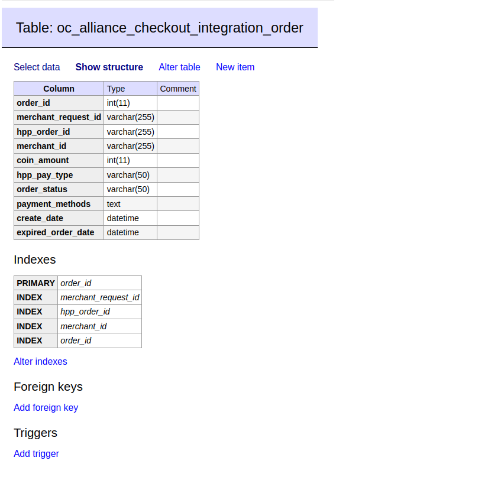

# Структура бази даних

## Цей модуль додає 2 таблиці в БД:&#x20;

**`alliance_checkout_integration_order`**

&#x20;**`alliance_checkout_integration_order_callback`**

### Структра таблиці **`alliance_checkout_integration_order`**

<figure><figcaption></figcaption></figure>

### Структра таблиці **`alliance_checkout_integration_order_callback`**

<figure><figcaption></figcaption></figure>
